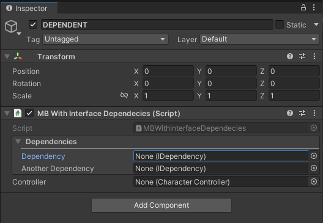
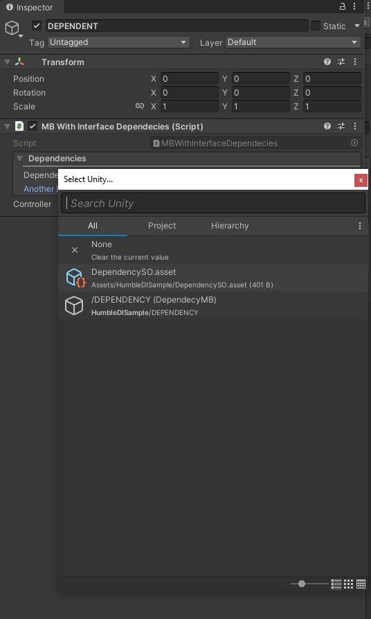

# Humble DI

Tiny dependency injection library for Unity3D based on interface dependency serialization.

## Installation

To add this to your project you can use one of two ways 

- Open `Window/PackageManager`, press plus button, choose `Add package from git URL...` and paste the following
into it.

```
https://github.com/nicktgn/unity-humble-di.git
```

OR

- Add git dependency to `Packages/manifest.json` file in your project directory:

```
"studio.lobsters-united.humble-di": "https://github.com/nicktgn/unity-humble-di.git"
```

## Features

- **Serializable interface fields**
  - Support for serializable Arrays and Lists of interfaces
- **Custom inspector with custom object picker for interface dependencies**
- `IProvider<>` interface to use POCO objects as dependencies
- TODO: Auto-resolution of dependencies
- TODO: Centralized dependency tree editor

### Serializable interface fields
Saves the assigned references to `MonoBehaviours` or `ScriptableObjects` that implement 
specified interfaces. Provides the level of indirection ([Dependency Inversion](https://en.wikipedia.org/wiki/Dependency_inversion_principle))
necessary for better code decoupling and flexible TDD development approach. **Lists and Arrays of interface types are also supported**

```csharp
public interface IFace {
    public void UseIt();
}

public class MyDependency : ScriptableObject, IFace {
    public void UseIt() {
        // some important implementation
    }
} 

public class MyMonoBehaviour : MonoBehaviour {
    
    // THIS IS REQUIRED PART
    [SerializeField] InterfaceDependencies iDeps;

    // This is now exposed as object field in inspector
    IFace myDependency;
    
    // This is now exposed as list of object fields in inspector
    List<IFace> listOfDependencies;
    
    // This is now exposed as list of object fields in inspector
    Iface[] arrayOfDependencies;

    void Start() {
        myDependency.UseIt();
        //...
    }
}
```

### Custom inspector with custom object picker for interface dependencies

Adding `InterfaceDependecies` field to `MonoBehaviour` or `ScriptableObject` is the only 
thing that is required to enable custom serialization of interface fields and expose them
in the inspector. Dependency fields support all the usual features like object picker and
drag-and-drop from Project or Scene views. If field value is set, clicking on the 
field will highlight the object in Project or Scene view (depending on where it came from).

 



## Rationale

~TODO~


## Usage

~TODO~

